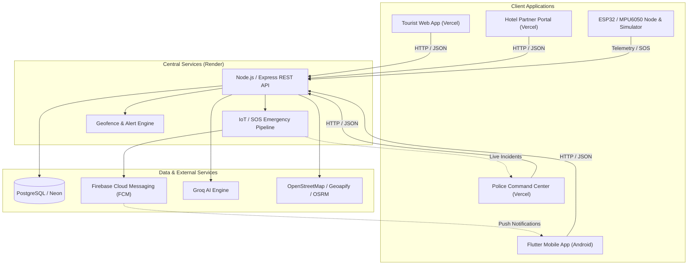

# TravelBuddy

TravelBuddy is a smart tourism safety, navigation, and emergency assistance platform built for the Smart India Hackathon (SIH) 2026. The platform seamlessly unifies AI-powered travel planning, multi-stop route and budget optimization, real-time geofenced danger perimeter alerts, wearable IoT fall and impact detection, and synchronized emergency dispatch between tourists, local police authorities, and hotel accommodation partners.

---

## Live Demo

TravelBuddy is deployed across production environments:

### Tourist Web App
- **URL:** [https://travelbuddy-web-iota.vercel.app](https://travelbuddy-web-iota.vercel.app)
- **Purpose:** Interactive tourist portal featuring AI trip planning, day-by-day itinerary generation, Traveling Salesperson Problem (TSP) route & budget optimization, City Explorer, place discovery, and an AI Travel Copilot.

### Police Command Center
- **URL:** [https://travelbuddy-police.vercel.app](https://travelbuddy-police.vercel.app)
- **Purpose:** Live incident monitoring and emergency dispatch console for law enforcement. Displays real-time SOS distress alerts, tourist locations, sensor telemetry, and allows managing restricted geofenced danger zones.

### Hotel Partner Portal
- **URL:** [https://travelbuddy-hotel.vercel.app](https://travelbuddy-hotel.vercel.app)
- **Purpose:** Operational dashboard for accommodation partners to verify tourist registration using their permanent tourist UID, manage guest check-ins/check-outs, and maintain emergency guest rosters.

### Backend API
- **URL:** [https://travelbuddy-u83z.onrender.com](https://travelbuddy-u83z.onrender.com)
- **Purpose:** Central REST API managing authentication, PostgreSQL data persistence, push notifications via Firebase Cloud Messaging (FCM), IoT sensor telemetry ingestion, and external AI/mapping proxies.

---

## Android App

The Android mobile application is distributed as a standalone APK for SIH 2026 evaluation.

- **APK Name:** `TravelBuddy-v1.0.0.apk`
- **GitHub Release:** [v1.0.0](https://github.com/anujks20/TravelBuddy/releases/tag/v1.0.0)
- **Direct Download:** [Download TravelBuddy-v1.0.0.apk](https://github.com/anujks20/TravelBuddy/releases/download/v1.0.0/TravelBuddy-v1.0.0.apk)

The mobile app connects directly to the production backend on Render and provides tourists with real-time location monitoring, geofence danger perimeter alarms, one-tap SOS triggering, and emergency contact syncing.

---

## Core Features

All documented capabilities are implemented and operational in the repository:

- **AI-Powered Trip Planning:** Dynamic travel planning with Groq LLM integration delivering customized day-by-day itineraries.
- **AI Itinerary Generation:** Structured travel schedules based on budget, pace, interests, and destination.
- **Travel Budget & Route Optimization:** Traveling Salesperson Problem (TSP) algorithm with OSRM and Leaflet mapping for optimized multi-stop transit and cost estimation.
- **City Explorer & Place Discovery:** Explore popular landmarks, attractions, and cultural points of interest using OpenStreetMap / Geoapify integration.
- **Where to Eat & Explore:** Curated dining and exploration recommendations categorized by location.
- **AI Travel Copilot:** Contextual chat assistant for real-time travel recommendations and queries.
- **Multilingual Support:** Multi-language UI support for international and domestic tourists.
- **Emergency SOS & Manual Triggering:** Instant emergency distress call button on both mobile and web clients.
- **IoT-Triggered Safety Alerts:** Automated SOS triggering via wearable ESP32 + MPU6050 accelerometer sensor upon fall or high-G impact detection.
- **Police Emergency Command Dashboard:** Interactive real-time map displaying active SOS incidents, tourist coordinates, and live telemetry.
- **SOS Lifecycle Management:** End-to-end incident tracking through pending, acknowledged, and resolved states with full audit logs.
- **Danger Zones & Geofencing:** Dynamic restricted perimeter configuration with automated mobile distance calculations and audible siren warnings on boundary breaches.
- **Permanent Tourist UID:** Unique identifier assigned to each tourist profile for seamless identification across police and hotel systems.
- **Hotel Tourist Registration & Check-In/Check-Out:** Instant tourist lookup by permanent UID, guest stay verification, and active roster management.
- **Emergency Contacts:** Secure registration and synchronization of personal emergency contacts for automated alerting.
- **IoT / ESP32 + MPU6050 Integration:** Physical wearable node firmware for continuous motion monitoring and Wi-Fi telemetry transmission.
- **IoT Telemetry Pipeline:** Continuous ingestion of acceleration vectors, impact shocks, and freefall metrics.
- **Demo IoT Simulator:** Standalone Python simulation script to demonstrate live telemetry and fall detection without requiring physical hardware.
- **Firebase Push Notifications:** Automated push alert dispatch (FCM) to mobile devices upon perimeter breaches or SOS status changes.
- **PostgreSQL Persistence:** Relational database persistence with UUID primary keys and JSONB fields on PostgreSQL / Neon.
- **JWT Authentication & Role-Based Access:** Role-segregated access control separating tourists, police dispatchers, and hotel administrators.

---

## System Architecture



### Concise Flow:
- **Tourist Web** &rarr; Render Backend API &rarr; PostgreSQL / Neon &rarr; Groq / External Services
- **Flutter Mobile** &rarr; Render Backend API &rarr; Firebase FCM
- **Police Dashboard** &rarr; Render Backend API &rarr; Live Incident Management
- **Hotel Portal** &rarr; Render Backend API &rarr; Tourist UID Lookup & Stays
- **ESP32 / MPU6050** &rarr; Render Backend API &rarr; IoT/SOS Pipeline &rarr; Police Dashboard / Mobile Safety State

---

## Technology Stack

- **Backend Runtime:** Node.js, Express.js
- **Database:** PostgreSQL (Neon Cloud / Local)
- **Mobile Client:** Flutter, Dart
- **Web Frontend (Tourist):** HTML5, Vanilla JavaScript, CSS3
- **Dashboards (Police & Hotel):** React 19, Vite
- **AI & LLM Services:** Groq API (Llama 3 models)
- **Push Notifications:** Firebase Admin SDK, Firebase Cloud Messaging (FCM)
- **Hardware & Embedded:** ESP32 Microcontroller, MPU-6050 6-Axis IMU
- **Mapping & Geodata:** Leaflet.js, OpenStreetMap (OSM), Geoapify, OSRM (Open Source Routing Machine)
- **Authentication:** JSON Web Tokens (JWT), bcrypt password hashing

---

## Deployment

| Component | Hosting Platform | Production URL |
|---|---|---|
| **Tourist Web Portal** | Vercel | [https://travelbuddy-web-iota.vercel.app](https://travelbuddy-web-iota.vercel.app) |
| **Police Command Center** | Vercel | [https://travelbuddy-police.vercel.app](https://travelbuddy-police.vercel.app) |
| **Hotel Partner Portal** | Vercel | [https://travelbuddy-hotel.vercel.app](https://travelbuddy-hotel.vercel.app) |
| **Central Backend API** | Render | [https://travelbuddy-u83z.onrender.com](https://travelbuddy-u83z.onrender.com) |
| **Database** | Neon PostgreSQL | Cloud-managed PostgreSQL instance |

---

## Demo Credentials

Pre-configured evaluation accounts for judges and evaluators:

| Role | Email | Password | Access Portal |
|---|---|---|---|
| **Tourist** | `test@travelbuddy.com` | `password123` | [Tourist Web App](https://travelbuddy-web-iota.vercel.app) / Android App |
| **Police** | `police@travelbuddy.com` | `police123` | [Police Command Center](https://travelbuddy-police.vercel.app) |
| **Hotel** | `hotel@travelbuddy.com` | `hotel123` | [Hotel Partner Portal](https://travelbuddy-hotel.vercel.app) |

> **Note:** These credentials are demo accounts intended strictly for evaluation and judging purposes.

---

## Mobile APK

The standalone Android release APK can be downloaded directly from the GitHub repository:

- **Release Page:** [GitHub Release v1.0.0](https://github.com/anujks20/TravelBuddy/releases/tag/v1.0.0)
- **Direct APK Download:** [TravelBuddy-v1.0.0.apk](https://github.com/anujks20/TravelBuddy/releases/download/v1.0.0/TravelBuddy-v1.0.0.apk)
- Install on any Android device (supports Android 8.0+ / API level 26+).

---

## Project Structure

```
TravelBuddy/
├── backend/            # Express.js REST API, PostgreSQL migrations, auth, and SOS engine
├── web/                # Tourist Web Portal, AI trip planner, route optimizer, and maps
├── mobile/             # Flutter cross-platform mobile app (Android & iOS)
├── police-dashboard/   # React 19 + Vite command center for emergency incident dispatch
├── hotel-portal/       # React 19 + Vite portal for tourist verification and check-ins
├── iot/                # ESP32 Arduino firmware and Python telemetry simulation engine
└── docs/               # Project documentation and architectural references
```

- **`backend/`**: Core API server providing routes for auth, trips, places, hotels, emergency contacts, geofences, and SOS events.
- **`web/`**: Responsive web application for tourists featuring AI itinerary planning and Leaflet-based route visualization.
- **`mobile/`**: Flutter client with native background geofencing, siren audio, and hardware SOS integration.
- **`police-dashboard/`**: Law enforcement console for monitoring live distress incidents and drawing danger perimeters.
- **`hotel-portal/`**: Accommodation verification portal using tourist permanent UIDs.
- **`iot/`**: Firmware for the ESP32 + MPU-6050 wearable device alongside `demo_iot_simulator.py` for software simulation.
- **`docs/`**: Supporting architectural diagrams, specifications, and project resources.

---

## Running Locally

### Prerequisites
- Node.js v18+ and npm v9+
- PostgreSQL v14+ (or a cloud PostgreSQL instance)
- Python 3.9+ (for IoT simulator)
- Flutter SDK v3.22+ and Android SDK (for mobile builds)

### 1. Backend Setup
```bash
cd backend
npm install
cp .env.example .env
# Edit .env with your local DB credentials and JWT secret
node src/config/initDb.js
npm run dev
# Backend runs on http://localhost:5000
```

### 2. Tourist Web App
```bash
cd web
npm install
cp .env.example .env
npm start
# Web app runs on http://localhost:3000
```

### 3. Police Command Center
```bash
cd police-dashboard
npm install
cp .env.example .env.local
npm run dev
# Dashboard runs on http://localhost:5173
```

### 4. Hotel Partner Portal
```bash
cd hotel-portal
npm install
cp .env.example .env.local
npm run dev
# Portal runs on http://localhost:5174
```

### 5. IoT Simulation Engine
```bash
cd iot
python -m venv venv
# Windows: .\venv\Scripts\activate | Linux/macOS: source venv/bin/activate
pip install requests
python demo_iot_simulator.py
```
To trigger a simulated fall event:
```bash
python trigger_event.py fall
```

### 6. Flutter Mobile App
```bash
cd mobile
flutter pub get
flutter run
```

> **Configuration Note:** All secrets and environment variables must be supplied via local configuration files (`.env`, `.env.local`, `config.h`) and must never be committed to source control.

---

## Security

TravelBuddy incorporates production-grade security practices:
- **Environment Isolation:** All sensitive credentials, API keys, and connection strings are managed through environment variables and excluded via `.gitignore`.
- **Role-Based Access Control (RBAC):** Express middleware validates JWT tokens and enforces distinct access privileges for `tourist`, `police`, and `hotel` roles.
- **Safe Authentication:** Passwords hashed with bcrypt; secure token storage on mobile via `flutter_secure_storage`.
- **Service Account Protection:** Firebase Admin SDK service account credentials are treated as private secrets and not committed to source control.
- **Cloud Configuration:** Live production secrets are securely provisioned directly within the Vercel and Render cloud hosting environments.

---

## SIH 2026

TravelBuddy was developed as an end-to-end solution for the **Smart India Hackathon (SIH) 2026**. 

### Problem Statement
Tourist safety, efficient emergency coordination, and seamless travel planning remain major challenges in popular tourist destinations. Incidents such as medical emergencies, falls in remote areas, or perimeter breaches into hazardous zones frequently suffer from delayed emergency dispatch and fragmented communication between tourists, hotels, and law enforcement.

### Solution
TravelBuddy bridges this critical gap through a unified smart ecosystem:
1. **Preventive Safety:** Real-time geofenced danger zones warn tourists before or upon entering hazardous locations.
2. **Immediate Incident Response:** Wearable IoT motion sensors detect falls and high-G impacts automatically, dispatching instant SOS alerts to the Police Command Center even if the user is incapacitated.
3. **Synchronized Ecosystem:** Law enforcement, hotel partners, and tourists share a synchronized safety and identification infrastructure via permanent tourist UIDs.
4. **Intelligent Assistance:** An integrated AI travel copilot and route optimizer that enriches the visitor journey while keeping safety paramount.

---

## License

Licensing terms have not yet been specified. All rights reserved.
