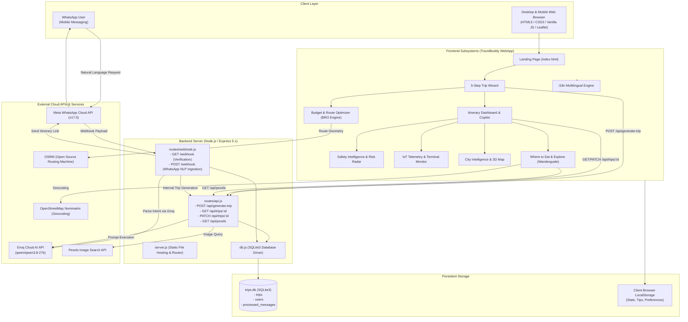
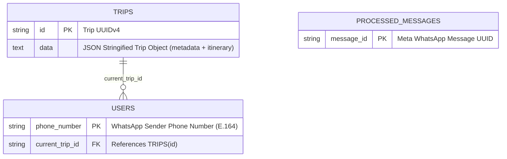
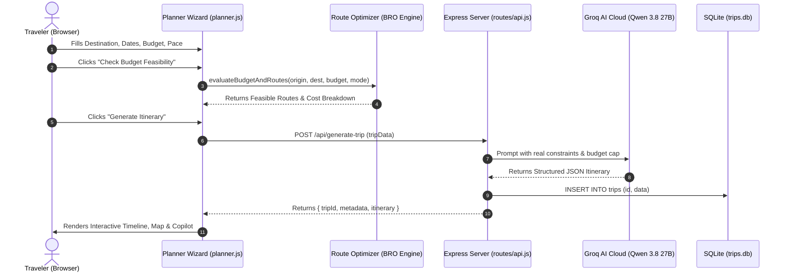
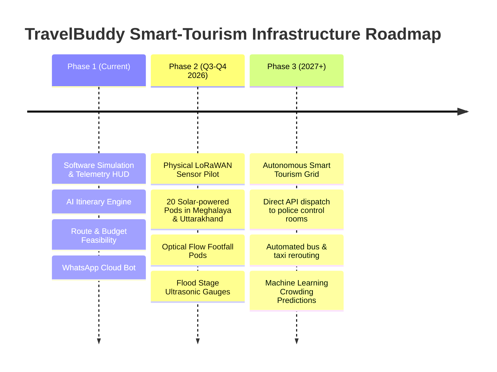

# TravelBuddy — Comprehensive Architecture & Technical Implementation Guide

> **Document Version:** 1.0.0  
> **Last Updated:** September 2026  
> **Target Audience:** Software Engineers, System Architects, Product Managers, Technical Evaluators, Hackathon / Project Judges, and Open Source Contributors.

---

## Table of Contents

1. [Executive Summary & Project Vision](#1-executive-summary--project-vision)
2. [End-to-End System Architecture](#2-end-to-end-system-architecture)
3. [Technology Stack & Dependencies](#3-technology-stack--dependencies)
4. [Repository File & Directory Structure](#4-repository-file--directory-structure)
5. [In-Depth Feature & Module Breakdown](#5-in-depth-feature--module-breakdown)
   - [Module 1: Cinematic Editorial Landing Page](#module-1-cinematic-editorial-landing-page)
   - [Module 2: 5-Step AI Itinerary Planning Wizard](#module-2-5-step-ai-itinerary-planning-wizard)
   - [Module 3: Itinerary Dashboard & AI Copilot](#module-3-itinerary-dashboard--ai-copilot)
   - [Module 4: Minimum Budget Feasibility & Best Route Optimizer](#module-4-minimum-budget-feasibility--best-route-optimizer)
   - [Module 5: TRAVELX Safety Intelligence & Risk Radar](#module-5-travelx-safety-intelligence--risk-radar)
   - [Module 6: Smart Destination Monitoring & IoT Telemetry](#module-6-smart-destination-monitoring--iot-telemetry)
   - [Module 7: City Intelligence & Local Explorer](#module-7-city-intelligence--local-explorer)
   - [Module 8: "Where to Eat & Explore" Curated Wanderguide](#module-8-where-to-eat--explore-curated-wanderguide)
   - [Module 9: Multilingual Internationalization (i18n Engine)](#module-9-multilingual-internationalization-i18n-engine)
   - [Module 10: Backend API & SQLite Persistence Layer](#module-10-backend-api--sqlite-persistence-layer)
   - [Module 11: WhatsApp Cloud Bot & Webhook Processing Engine](#module-11-whatsapp-cloud-bot--webhook-processing-engine)
6. [Mathematical Models & Algorithms](#6-mathematical-models--algorithms)
7. [Database Schema & Entity Relationship](#7-database-schema--entity-relationship)
8. [Data Flow & Lifecycle Sequences](#8-data-flow--lifecycle-sequences)
9. [Configuration & Environment Variables](#9-configuration--environment-variables)
10. [Local Development, Setup & Deployment Guide](#10-local-development-setup--deployment-guide)
11. [Fault Tolerance, Caching & Resilience Strategies](#11-fault-tolerance-caching--resilience-strategies)
12. [Future Scope & Hardware Production Roadmap](#12-future-scope--hardware-production-roadmap)

---

## 1. Executive Summary & Project Vision

**TravelBuddy** is an intelligent, full-stack smart-tourism and travel engineering platform. Unlike standard travel aggregators that only output generic lists of attractions, TravelBuddy unites **cutting-edge Generative AI**, **mathematical route and budget optimization**, **real-time destination safety intelligence**, **remote IoT sensor telemetry simulation**, **community-driven local discovery**, and **omnichannel WhatsApp bot interaction** into a seamless, luxury-grade web application.

### Key Value Propositions (USPs)
1. **Budget-Bounded Route Feasibility:** Answers *“Can I afford this trip, and which exact highway/transit route minimizes cost while maximizing quality?”* using multi-criteria weighted scoring and real routing engines.
2. **Generative AI Itinerary Crafting & Copilot:** Dynamically synthesizes personalized, realistic, timed travel itineraries using Groq AI (`qwen/qwen3.8-27b`), complete with dynamic image fetching (Pexels API) and real-time conversational tweaking.
3. **Safety Intelligence & Risk Radar:** Evaluates live weather, crowd density, time-of-day risks, road safety, and medical emergency readiness before travelers step out.
4. **IoT Destination Telemetry & Capacity Management:** Simulates edge sensor pods (ultrasonic water gauges, optical crowd counters, rain intensity meters, inclinometers) to prevent over-tourism and dispatch emergency advisories.
5. **Authentic Local Intelligence:** Connects tourists with crowdsourced, verified local insider tips alongside 3D isometric interactive maps.
6. **Omnichannel Accessibility:** Instant trip planning via WhatsApp messages with automatic database synchronization and shareable web links.

---

## 2. End-to-End System Architecture

The following diagram illustrates the complete architectural interaction across client browsers, WhatsApp users, backend Node.js microservices, SQLite persistence, and external AI/Geo APIs:



---

## 3. Technology Stack & Dependencies

### Frontend
- **Languages:** HTML5 (Semantic, Accessible), CSS3 (Custom Design System, Variables, Glassmorphism, CSS Grid & Flexbox), Vanilla JavaScript (ES6+, Asynchronous Fetch, IIFE Modules).
- **Mapping & Geolocation:** [Leaflet.js](https://leafletjs.com/) v1.9.4 (OpenStreetMap tile layers, custom SVG markers, dynamic polyline rendering, interactive tooltips).
- **Typography:** Google Fonts (`Instrument Serif` for editorial luxury headings, `Inter` for clean UI/body copy, `Caveat` for handwritten accents).
- **Internationalization:** Custom zero-dependency translation engine supporting English, Hindi (हिन्दी), Tamil (தமிழ்), Marathi (मराठी), and Gujarati (ગુજરાતી).

### Backend
- **Runtime:** Node.js (v18.x / v20.x).
- **Web Framework:** Express.js (`^5.2.1`) for high-performance routing, JSON body parsing, and static file delivery.
- **Database:** SQLite3 (`^6.0.1`) embedded SQL engine stored locally in `trips.db`.
- **HTTP Client:** Axios (`^1.20.0`) with automated timeout and rate-limit backoff handling.
- **Utilities:** `uuid` (`^14.0.2`) for cryptographically secure UUIDv4 trip identifiers, `cors` (`^2.8.6`) for cross-origin resource sharing, `dotenv` (`^17.4.2`) for environment configuration.

### External APIs
- **Groq Cloud API:** High-speed LLM inference utilizing `qwen/qwen3.8-27b` with structured JSON mode.
- **Pexels REST API:** Contextual HD travel photography and venue imagery.
- **Project-OSRM API:** Real-time road routing, polyline geometry, distance matrix, and highway alternatives.
- **OpenStreetMap Nominatim:** Forward geocoding for city coordinates and bounding boxes.
- **Meta WhatsApp Cloud API (Graph API v17.0):** Two-way conversational messaging gateway.

---

## 4. Repository File & Directory Structure

```text
TravelBuddy/
├── .env                                  # Environment variables (API keys, ports, tokens)
├── package.json                          # Node.js project manifest & dependencies
├── package-lock.json                     # Locked dependency tree
├── server.js                             # Express HTTP server & static file host
├── db.js                                 # SQLite database initialization & table setup
├── trips.db                              # SQLite database file (auto-created on startup)
│
├── routes/
│   ├── api.js                            # REST API endpoints (Trip generation, CRUD, Pexels proxy)
│   └── webhook.js                        # WhatsApp Cloud API webhook & NLP parser
│
├── index.html                            # Editorial luxury landing page with background video
├── styles.css                            # Global design tokens, typography & landing styles
├── script.js                             # Landing page interactions & animations
│
├── planner.html                          # Single-Page Application (SPA) container for all 6 views
├── planner.css                           # Styling for Wizard, Dashboard, Safety, IoT, City Explorer & Wanderguide
├── planner.js                            # Main SPA orchestration engine (~5,600 lines)
│
├── i18n.js                               # Multilingual dictionary & dynamic DOM translation engine
│
├── css/
│   └── budgetRouteOptimizer.css          # Dedicated styling for Route & Budget Feasibility module
├── js/
│   └── budgetRouteOptimizer.js           # Reusable mathematical optimization & OSRM routing engine
│
├── budgetRouteOptimizer.css              # Root mirror for modular path resolution
├── budgetRouteOptimizer.js               # Root mirror for modular path resolution
│
├── design.md                             # UI/UX design specifications & aesthetic rules
├── p2.md                                 # Technical requirement spec: City Explorer & Telemetry
├── p3.md                                 # Technical requirement spec: Route & Budget Optimizer
│
├── india_tourism_slow_0.7x_gwr_video_mvp.mp4  # Cinematic background video for planner
├── https_designerstephengithub (1).mp4   # Cinematic video asset for hero section
└── planner-bg.jpg                        # High-resolution fallback background image
```

---

## 5. In-Depth Feature & Module Breakdown

---

### Module 1: Cinematic Editorial Landing Page
- **Files:** [index.html](file:///c:/Users/rikki/Desktop/TravelBuddy%20website/TravelBuddy/index.html), [styles.css](file:///c:/Users/rikki/Desktop/TravelBuddy%20website/TravelBuddy/styles.css), [script.js](file:///c:/Users/rikki/Desktop/TravelBuddy%20website/TravelBuddy/script.js)
- **Design Philosophy:** Minimalist Editorial with high-contrast typography (`Instrument Serif` at 80px with tight tracking `-2.46px`, `Inter` navigation).
- **Core Components:**
  - **Full-Bleed Video Background:** Plays ambient cinematic footage (`serene-art-hero.mp4`) with a soft dark overlay (`alpha 0.2`) ensuring high contrast and legibility.
  - **Distributed 3-Column Navigation:** Brand logo with superscript trademark, center navigation links with smooth dropdowns, and pill-shaped conversion CTA buttons.
  - **Staggered Keyframe Animations:** CSS `@keyframes fadeRise` applied with 200ms stagger increments (`stagger-1`, `stagger-2`, `stagger-3`) for an unfolding luxury aesthetic.
  - **Language Selector:** Real-time dropdown to switch application languages on the fly.

---

### Module 2: 5-Step AI Itinerary Planning Wizard
- **Files:** [planner.html](file:///c:/Users/rikki/Desktop/TravelBuddy%20website/TravelBuddy/planner.html#L52-L210), [planner.js](file:///c:/Users/rikki/Desktop/TravelBuddy%20website/TravelBuddy/planner.js#L10-L280), [planner.css](file:///c:/Users/rikki/Desktop/TravelBuddy%20website/TravelBuddy/planner.css)
- **Step-by-Step Flow:**
  1. **Step 1 (Where & When):** Origin input with live auto-suggestions, Destination input, Travel Mode selector cards (Car, Bus, Train, Motorcycle, Flight), and Start/End Date pickers.
  2. **Step 2 (Who & How):** Traveler counter (1 to 20 persons) and Travel Pace selector cards (*Relaxed*, *Balanced*, *Packed*).
  3. **Step 3 (Interests & Preferences):** Multi-select interest badges (*Culture & History*, *Food & Dining*, *Nature & Outdoors*, *Shopping*, *Nightlife*, *Adventure*, *Relaxation*) and dietary requirements input.
  4. **Step 4 (Budget & Details):** Currency selector (`INR ₹`, `USD $`), numeric budget input, special accessibility/must-visit notes, and an **Inline Budget Feasibility Trigger** that calculates route costs before generating an itinerary.
  5. **Step 5 (Review & Summary):** Visual recap card summarizing all entered constraints, estimated travel days, and dynamic route options.
- **Form State Management:** Centralized `tripData` JavaScript object updated through bi-directional event listeners and synchronized with browser `localStorage`.

---

### Module 3: Itinerary Dashboard & AI Copilot
- **Files:** [planner.html](file:///c:/Users/rikki/Desktop/TravelBuddy%20website/TravelBuddy/planner.html#L221-L290), [planner.js](file:///c:/Users/rikki/Desktop/TravelBuddy%20website/TravelBuddy/planner.js), [routes/api.js](file:///c:/Users/rikki/Desktop/TravelBuddy%20website/TravelBuddy/routes/api.js#L83-L153)
- **Key Capabilities:**
  - **AI Generation Engine:** Sends comprehensive structured prompts to Groq AI (`qwen/qwen3.8-27b`) requesting strict JSON schema containing daily time-slotted activities (`time`, `type`, `title`, `desc`, `cost`, `locked`).
  - **Timeline Presentation:** Renders responsive cards categorized by Sightseeing, Food, Culture, and Transit, featuring activity locking, deletion, custom editing, and real-time cost recalculation.
  - **AI Copilot Sidebar:** An embedded interactive AI chat assistant. Users can prompt: *"Make day 2 cheaper"*, *"Add more nature spots"*, or *"Switch to vegetarian dining"*, and the Copilot updates the itinerary in real time.
  - **Dynamic Stats & Cost Breakdown:** Real-time summary of estimated expenses (Lodging, Food, Sightseeing, Transport, Miscellaneous) paired with an automated **Trip Quality Score** (0–100 scale).
  - **Integrated Google Maps / Leaflet Embed:** Contextually focuses on destination points of interest.
  - **Export & Persistence:** Export itinerary as PDF/Print or save to the SQLite database with a shareable permanent link (`planner.html?tripId=<UUID>`).

---

### Module 4: Minimum Budget Feasibility & Best Route Optimizer
- **Files:** [budgetRouteOptimizer.js](file:///c:/Users/rikki/Desktop/TravelBuddy%20website/TravelBuddy/js/budgetRouteOptimizer.js), [budgetRouteOptimizer.css](file:///c:/Users/rikki/Desktop/TravelBuddy%20website/TravelBuddy/css/budgetRouteOptimizer.css), [planner.html](file:///c:/Users/rikki/Desktop/TravelBuddy%20website/TravelBuddy/planner.html#L1116-L1190)
- **Mathematical Architecture:**
  - **Dynamic Routing:** Calls OSRM (`router.project-osrm.org`) to compute real highway routes, driving durations, and exact GeoJSON coordinates. Falls back gracefully to Haversine great-circle formulas with topological spline curve offsets if offline.
  - **Multi-Modal Fare Modeling:**
    - *Car / Cab:* $\text{Fuel Cost} = \text{RoundTrip Distance (km)} \times \text{Fuel Rate/km} + \text{Tolls}$.
    - *Bus:* Tiered per-km transit rates with sleeper/semi-sleeper pricing curves.
    - *Train:* Indian Railways standard slab rates (Sleeper vs 3AC/2AC).
    - *Motorcycle:* Ultra-high fuel efficiency models (~₹2.2/km).
    - *Flight:* Base airfare + distance scale + dynamic fuel surcharge.
  - **Dual Optimization Modes:**
    1. **Minimum Budget Mode:** Greedy sorting to extract the lowest round-trip cost route ($C_{roundtrip} \le \text{Budget}$).
    2. **Best Overall Mode:** Multi-criteria weighted scoring evaluating Cost (40%), Travel Time (30%), Road Quality (20%), and Scenic Value (10%).
  - **Interactive Route Map & Benchmark Presets:** Leaflet-powered visual map rendering primary and alternative routes in color-coded polylines (Cyan for selected, Purple for alternatives). Includes one-click test presets (*Delhi $\to$ Rishikesh ₹1,000*, *Infeasible ₹800*, *Mumbai $\to$ Pune*, *Bengaluru $\to$ Mysuru*).

---

### Module 5: TRAVELX Safety Intelligence & Risk Radar
- **Files:** [planner.html](file:///c:/Users/rikki/Desktop/TravelBuddy%20website/TravelBuddy/planner.html#L302-L496), [planner.js](file:///c:/Users/rikki/Desktop/TravelBuddy%20website/TravelBuddy/planner.js)
- **Safety Analytics Features:**
  - **Overall Safety Score Ring:** Animated SVG circular progress ring (0–100%) indicating destination safety level (*Optimal*, *Moderate*, *Advisory*).
  - **Category Breakdown:** Granular sub-scores for Night Safety, Solo Traveler Friendliness, Women Safety, Healthcare Accessibility, and Scams/Theft Risk.
  - **Weather Safety Timeline:** 24-hour temperature, precipitation percentage, humidity, wind velocity, and UV index forecasts with automated advisory flags (*e.g., "Heavy afternoon rain — avoid riverside trails"*).
  - **Crowd Density Intelligence:** AI-estimated footfall curves per hour highlighting peak congestion vs. peaceful exploring hours.
  - **Safe Route Recommendation:** Embedded visual map highlighting primary well-lit, police-patrolled transit corridors.
  - **Travel Risk Radar & Trip Readiness Index:** Progress bars measuring packing readiness, offline map downloads, medication stock, and insurance verification.
  - **Travel Safety Center:** Emergency hotlines (112 / 911), dynamic nearby hospital locator map, and a 1-click **WhatsApp Emergency Location Share** button.

---

### Module 6: Smart Destination Monitoring & IoT Telemetry
- **Files:** [planner.html](file:///c:/Users/rikki/Desktop/TravelBuddy%20website/TravelBuddy/planner.html#L498-L850), [planner.js](file:///c:/Users/rikki/Desktop/TravelBuddy%20website/TravelBuddy/planner.js)
- **Smart Tourism & Capacity Management:**
  - **Destination Infrastructure Metrics:** Live counts and occupancy metrics for Hotels Monitored (e.g., 340 hotels, 8,200 rooms, 76% occupancy), Tracked Attractions, Registered Tour Operators, and Eco-Tourist Zones.
  - **Time-of-Day Telemetry Simulation:** Interactive time pills (*06:00 AM Dawn*, *09:00 AM Morning Peak*, *01:00 PM Afternoon*, *05:00 PM Monsoon Influx*, *09:00 PM Night Calm*) that update the entire telemetry state.
  - **Dark Terminal HUD Console:** Visual replica of an industrial edge-monitoring console displaying live tourist counts, hotel occupancy %, crowd level badges, river water surge levels, and LoRaWAN mesh uplink status (868 MHz, 42ms ping).
  - **Early Warning & Broadcast System:** Automatic trigger of advisory alerts (*"Optical flow monitors register 240 persons/min approaching suspension bridges"*). Includes a simulated **Broadcast Warning to 65 Travel Operators** action that dispatches instant toast alerts.
  - **Custom IoT Hardware Specifications (Future Scope):**
    1. *Hydro-Sense Edge X1:* Solar/Supercapacitor ultrasonic river velocity and flood stage gauge.
    2. *CrowdSense LiDAR Pod:* ARM Cortex-M55 TinyML privacy-preserving footfall profiler (zero facial recognition).
    3. *Pluvio-Mesh Optical Gauge:* Piezoelectric kinetic raindrop impact detector with 15-minute cloudburst pre-alert.
    4. *GeoSlope Tilt & Moisture Probe:* Subsurface dual-axis inclinometer detecting hillside mudslip risks along national highways.

---

### Module 7: City Intelligence & Local Explorer
- **Files:** [planner.html](file:///c:/Users/rikki/Desktop/TravelBuddy%20website/TravelBuddy/planner.html#L852-L977), [planner.js](file:///c:/Users/rikki/Desktop/TravelBuddy%20website/TravelBuddy/planner.js)
- **Local Discovery Features:**
  - **Interactive 3D / Isometric Destination View:** Leaflet map with custom stylized dark tiles, 3D building perspective, and category-filtered markers (*Attractions, Culture, Food, Nature*).
  - **Synced Split Layout:** Clicking a place card pans and zooms the map to its exact pin with an animated popup; clicking a map marker highlights and scrolls to the card.
  - **Place Detail Modal:** Rich view displaying high-res photos, ratings, estimated visit duration, category badges, and a 1-click **Add to Trip** button that injects the place directly into the active itinerary.
  - **"What Locals Recommend" Feed:** Authentic community advice feed (*e.g., "Hidden sunset spot behind Parmarth Niketan"*, *"Best morning masala chai stall"*).
  - **"Share Your Local Recommendation" Form:** Allows local residents and guides to submit recommendations (Title, Place, Category, Practical Tip, Author) persisted immediately in browser `localStorage`.
  - **Community Trust & Safety:** Built-in validation, disclaimer tags, and community moderation notices.

---

### Module 8: "Where to Eat & Explore" Curated Wanderguide
- **Files:** [planner.html](file:///c:/Users/rikki/Desktop/TravelBuddy%20website/TravelBuddy/planner.html#L979-L1114), [planner.js](file:///c:/Users/rikki/Desktop/TravelBuddy%20website/TravelBuddy/planner.js)
- **Wanderlog-Style Editorial Interface:**
  - **Curated City Guides:** Quick chips for major destinations (*Greater Noida, Mumbai, Delhi, Jaipur, Bangalore, Paris, Tokyo*).
  - **Dynamic AI Venue Discovery:** Real-time Groq AI prompt generation paired with OpenStreetMap Nominatim geocoding to retrieve genuine restaurants, cafes, dhabas, fine dining, and cultural landmarks.
  - **Sticky Category Filter Bar:** One-touch filtering across *Best Restaurants*, *Cafes & Bakeries*, *Italian & Fine Dining*, *Local Food & Dhabas*, *Bars & Lounges*, *Stays & Hotels*, and *Sightseeing*.
  - **Dual Synchronized View:** Left-column scrollable editorial cards featuring high-res imagery, review counts, price indicators, and award badges; Right-column sticky interactive Leaflet map with numbered pins, floating count pills, and bottom-sheet preview cards.
  - **Sorting Engine:** Dynamic sort by *Curated Ranking*, *Highest Rating (⭐)*, or *Most Reviews*.

---

### Module 9: Multilingual Internationalization (i18n Engine)
- **Files:** [i18n.js](file:///c:/Users/rikki/Desktop/TravelBuddy%20website/TravelBuddy/i18n.js)
- **Architecture & Performance:**
  - **Comprehensive Multi-Language Dictionary:** Full translation tables for English, Hindi (`hi`), Tamil (`ta`), Marathi (`mr`), and Gujarati (`gu`).
  - **Automated DOM Walkers:** Scans elements matching `[data-i18n]` (text content) and `[data-i18n-placeholder]` (input placeholder text) and mutates the DOM instantly with zero layout shift.
  - **State Persistence:** Automatically stores user language preference in `localStorage.getItem('tb_lang')` and persists it across page transitions and reloads.
  - **AI Prompt Integration:** When generating or modifying itineraries in non-English modes, the system injects locale directives to ensure Groq AI returns translated descriptions.

---

### Module 10: Backend API & SQLite Persistence Layer
- **Files:** [server.js](file:///c:/Users/rikki/Desktop/TravelBuddy%20website/TravelBuddy/server.js), [db.js](file:///c:/Users/rikki/Desktop/TravelBuddy%20website/TravelBuddy/db.js), [routes/api.js](file:///c:/Users/rikki/Desktop/TravelBuddy%20website/TravelBuddy/routes/api.js)
- **REST Endpoints:**

| Method | Endpoint | Description | Request Body / Params | Response |
| :--- | :--- | :--- | :--- | :--- |
| `POST` | `/api/generate-trip` | Invokes Groq AI to synthesize itinerary and saves it to SQLite | JSON trip metadata (origin, destination, dates, budget, etc.) | `{ tripId, metadata, itinerary }` |
| `GET` | `/api/trips/:tripId` | Retrieves saved trip by UUID | URL param `tripId` | Full Trip JSON payload |
| `PATCH` | `/api/trips/:tripId` | Updates an existing trip (e.g. Copilot tweaks, activity locks) | URL param `tripId`, updated JSON payload | `{ success: true, tripId }` |
| `GET` | `/api/pexels` | Server-side proxy for Pexels HD photo search (prevents API key leakage) | Query param `?query=city+landmark` | `{ url: "https://..." }` |

- **Security & Reliability:**
  - Server-side API key protection: `GROQ_API_KEY` and `PEXELS_API_KEY` are kept strictly in backend `.env`.
  - Rate-limit backoff logic: Catches Groq HTTP 429 errors, parses recommended retry intervals (`try again in Xs`), pauses execution, and automatically retries.
  - Robust JSON extraction regex that strips markdown formatting (` ```json ... ``` `) and handles incomplete AI tokens.

---

### Module 11: WhatsApp Cloud Bot & Webhook Processing Engine
- **Files:** [routes/webhook.js](file:///c:/Users/rikki/Desktop/TravelBuddy%20website/TravelBuddy/routes/webhook.js)
- **Conversational Booking Lifecycle:**
  1. **Webhook Verification (GET):** Validates Meta challenge token against `WEBHOOK_VERIFY_TOKEN` and responds with `hub.challenge`.
  2. **Message Ingestion & Deduplication (POST):** Receives incoming WhatsApp messages from Meta Graph API. Checks `processed_messages` SQLite table by `message_id` to guarantee **strict idempotency** and avoid duplicate AI generation.
  3. **Instant Acknowledgment:** Returns HTTP 200 to WhatsApp immediately and dispatches an instant typing reply: *"I'm working on your trip... Give me a few seconds! ✈️"*.
  4. **NLP Intent Extraction:** Sends the user's raw message (*e.g., "Plan a 3-day adventure trip to Rishikesh under 10000 INR"*) to Groq AI to extract `{ destination, days, budget, currency }`.
  5. **Automated Trip Creation:** Triggers the internal `/api/generate-trip` engine, stores the generated trip in SQLite, and links the user's phone number to `current_trip_id`.
  6. **Link Dispatch:** Sends a formatted WhatsApp message containing the direct link:  
     `https://your-domain.com/planner.html?tripId=8f7e2d14-...`

---

## 6. Mathematical Models & Algorithms

### 1. Haversine Great-Circle Distance
Used for geocoding calculations and offline fallback routing:
$$d = 2 R \arcsin \left( \sqrt{\sin^2\left(\frac{\Delta \phi}{2}\right) + \cos(\phi_1) \cos(\phi_2) \sin^2\left(\frac{\Delta \lambda}{2}\right)} \right)$$
*Where $R = 6371\text{ km}$, $\phi$ is latitude in radians, and $\lambda$ is longitude in radians.*

### 2. Multi-Modal Round-Trip Cost Model
For a given route $r$ and travel mode $M$:
$$C_{\text{roundtrip}}(r, M) = 2 \times \Big( \text{Distance}(r) \times \text{Rate}_{\text{fuel/fare}}(M) \Big) + 2 \times \text{TollCost}(r)$$

### 3. Budget Feasibility Condition
A route $r$ is feasible if and only if:
$$\text{IsFeasible}(r) = \begin{cases} \text{true} & \text{if } C_{\text{roundtrip}}(r) \le B_{\text{user}} \\ \text{false} & \text{if } C_{\text{roundtrip}}(r) > B_{\text{user}} \end{cases}$$
$$\text{Minimum Feasible Travel Budget} = \min_{r \in \text{Routes}} C_{\text{roundtrip}}(r)$$

### 4. Multi-Criteria Weighted Route Scoring (Best Overall Mode)
For all feasible routes $r \in \text{FeasibleRoutes}$, each metric is normalized into a $[0, 100]$ score:
$$\text{Score}(r) = w_{\text{cost}} \cdot S_{\text{cost}}(r) + w_{\text{time}} \cdot S_{\text{time}}(r) + w_{\text{quality}} \cdot S_{\text{quality}}(r) + w_{\text{scenic}} \cdot S_{\text{scenic}}(r)$$
*Default Balanced Weights: $w_{\text{cost}} = 0.40, w_{\text{time}} = 0.30, w_{\text{quality}} = 0.20, w_{\text{scenic}} = 0.10$ ($\sum w_i = 1.0$).*

---

## 7. Database Schema & Entity Relationship

The SQLite database (`trips.db`) is structured with three core tables ensuring simplicity, zero external database setup, and fast queries:



### Table Definitions
```sql
-- 1. Trips Table: Stores all trip itineraries and metadata
CREATE TABLE IF NOT EXISTS trips (
    id TEXT PRIMARY KEY,
    data TEXT NOT NULL
);

-- 2. Users Table: Maps WhatsApp phone numbers to their latest active trip
CREATE TABLE IF NOT EXISTS users (
    phone_number TEXT PRIMARY KEY,
    current_trip_id TEXT,
    FOREIGN KEY(current_trip_id) REFERENCES trips(id)
);

-- 3. Processed Messages Table: Prevents duplicate webhook execution
CREATE TABLE IF NOT EXISTS processed_messages (
    message_id TEXT PRIMARY KEY
);
```

---

## 8. Data Flow & Lifecycle Sequences

### Web User Trip Generation Lifecycle



---

## 9. Configuration & Environment Variables

Create or edit the `.env` file in the root of the `TravelBuddy/` directory with the following variables:

```env
# Server Configuration
PORT=3000
PUBLIC_BASE_URL=http://localhost:3000

# Groq Cloud AI API (Required for Itinerary & Copilot generation)
GROQ_API_KEY=gsk_your_actual_groq_api_key_here

# Pexels API (Required for High-Resolution photo fetching)
PEXELS_API_KEY=your_actual_pexels_api_key_here

# Meta WhatsApp Cloud API (Optional: Required for WhatsApp Bot)
WHATSAPP_TOKEN=EAAG...your_meta_access_token_here
WEBHOOK_VERIFY_TOKEN=travelbuddy_secure_verify_token_2026
```

---

## 10. Local Development, Setup & Deployment Guide

### Prerequisites
- [Node.js](https://nodejs.org/) v18.0.0 or higher
- `npm` (comes bundled with Node.js)
- A modern web browser (Chrome, Firefox, Edge, Safari)

### Step-by-Step Installation
```bash
# 1. Navigate to the TravelBuddy project directory
cd "c:/Users/rikki/Desktop/TravelBuddy website/TravelBuddy"

# 2. Install all npm dependencies
npm install

# 3. Configure environment variables
# Verify that .env exists and contains your valid GROQ_API_KEY

# 4. Start the Node.js Express server
node server.js
```

### Accessing the Application
- **Main Landing Page:** [http://localhost:3000/index.html](http://localhost:3000/index.html)
- **AI Trip Planner & Wizard:** [http://localhost:3000/planner.html](http://localhost:3000/planner.html)
- **City Intelligence & Local Explorer:** [http://localhost:3000/planner.html?view=explorer](http://localhost:3000/planner.html?view=explorer)
- **Route & Budget Optimizer:** [http://localhost:3000/planner.html?view=route-optimizer](http://localhost:3000/planner.html?view=route-optimizer)
- **Safety Intelligence Dashboard:** [http://localhost:3000/planner.html?view=safety](http://localhost:3000/planner.html?view=safety)
- **IoT Destination Telemetry Monitor:** [http://localhost:3000/planner.html?view=monitoring](http://localhost:3000/planner.html?view=monitoring)
- **Where to Eat & Explore (Wanderguide):** [http://localhost:3000/planner.html?view=wanderguide](http://localhost:3000/planner.html?view=wanderguide)

### WhatsApp Bot Webhook Setup (Optional for Live Messaging)
1. Expose your local port 3000 via a tunnel (e.g. `ngrok http 3000`).
2. Go to Meta for Developers $\to$ WhatsApp $\to$ Configuration.
3. Set **Callback URL** to `https://your-ngrok-url.ngrok-free.app/webhook`.
4. Set **Verify Token** to the value of `WEBHOOK_VERIFY_TOKEN` in your `.env`.
5. Subscribe to `messages` events.

---

## 11. Fault Tolerance, Caching & Resilience Strategies

1. **AI Rate-Limit Auto-Retry:** When Groq API returns a rate limit (HTTP 429), `routes/api.js` parses the response wait time, sleeps for the designated seconds + 1s buffer, and automatically retries up to 3 times before failing.
2. **Offline Routing Fallback:** If the OSRM routing server is unreachable, `budgetRouteOptimizer.js` automatically falls back to mathematical Haversine calculations and generated polyline curves so the user is never blocked.
3. **Pexels In-Memory Caching:** All fetched image URLs are cached in a client/server Map (`pexelsCache`) to minimize redundant network calls and conserve API quota.
4. **Idempotent Webhook Processing:** Meta WhatsApp Cloud API retries unacknowledged webhooks. TravelBuddy logs every processed `message_id` in SQLite, instantly acknowledging duplicates to prevent duplicate LLM calls.
5. **Client-Side State Recovery:** `localStorage` persists the active destination, language preferences, and submitted local recommendations across accidental page reloads.

---

## 12. Future Scope & Hardware Production Roadmap

The **Smart Destination Monitoring & IoT Telemetry** module is designed with a realistic 3-phase commercialization roadmap:



---

## Summary Cheat Sheet for Presenters & Reviewers

- **What is the tech stack?** HTML5, CSS3, Vanilla JS, Node.js, Express 5, SQLite3, Leaflet.js, Groq AI (`qwen/qwen3.8-27b`), OSRM, Pexels API, Meta WhatsApp Graph API.
- **Is there a backend?** Yes, a lightweight, fast Node.js/Express server with SQLite database persistence and WhatsApp webhook ingestion.
- **Can it run completely without external databases?** Yes, SQLite (`trips.db`) is zero-config and runs locally out of the box.
- **How does it optimize routes?** Real OSRM highway routing + Haversine fallback + multi-modal cost calculations + Greedy minimum budget selection + Multi-criteria weighted scoring.
- **Does it support multiple languages?** Yes, full dynamic client-side i18n support for English, Hindi, Tamil, Marathi, and Gujarati.
